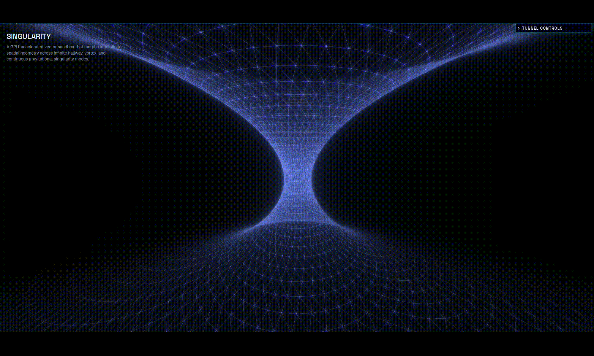

# Hey, I'm Njoki Njeri 

```

           ██ ████████████████████████████████████████████████ ██
           ██ ████████████████████████████████████████████████ ██
           ██ ██                                            ██ ██
           ██ ██                                            ██ ██
           ██ ██      [██████████████░░░░░░░░░░]            ██ ██
           ██ ██                                            ██ ██
           ██ ██          > building. _                     ██ ██
           ██ ██                                            ██ ██
           ██ ██                                            ██ ██
           ██ ██                                            ██ ██
           ██ ██                                            ██ ██
           ██ ██                                            ██ ██
           ██ ████████████████████████████████████████████████ ██
           ██                                                  ██
           ██████████████████████████████████████████████████████
                    ████████████████████████████████████
                  ████████████████████████████████████████
                ████████████████████████████████████████████
              ████████████████████████████████████████████████
            ████████████████████████████████████████████████████


> @njokinjeri
> developer ~ tinkerer ~ perpetual learner
> building. _
```

I'm a developer obsessed with the web, how it works, what it can do, and what happens when you push it past its limits. I believe ideas shouldn't wait.
 
Experiment, fail, learn, try again. Right now, I'm running an experimental creative series putting that philosophy into practice, one project at a time.

---

### 🧪 Impractical Series Spotlight

<div align="center">

### [Singularity ↗](https://njokinjeri.github.io/impractical-series/src/experiments/singularity/)

[](https://njokinjeri.github.io/impractical-series/src/experiments/singularity/)

*A GPU-accelerated vector sandbox exploring spatial geometry across infinite hallway, vortex, and continuous gravitational singularity modes.*

[**🌀 Launch Simulation**](https://njokinjeri.github.io/impractical-series/src/experiments/singularity/)

</div>

---

## 🛠️ Toolbox

**Core Stack**  
      

**Creative & Graphics**  
  

**Currently Exploring**  


Catch me sharing builds on:
 
[](https://www.linkedin.com/in/njokinjeri/)


*"Semper est locus emendationi."* :-: There is always room for improvement.


<p align="center">
</p>
