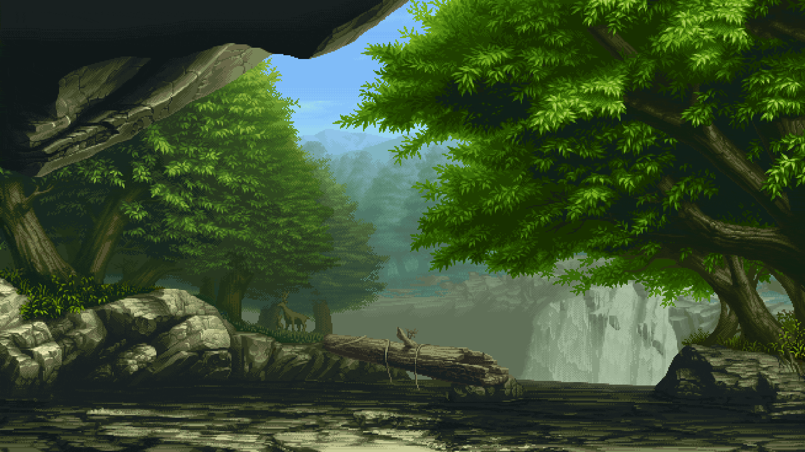
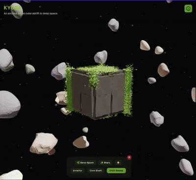

# Hey, I'm Njoki Njeri

  <code>developer ~ tinkerer ~ perpetual learner</code>

I'm a developer exploring the web through code, experimentation, and creative engineering.
I build to understand, experiment to push boundaries, and learn by doing.

_I'm currently running an experimental series where I turn ideas into interactive builds and explore how far I can take them._

---

### 🧪 Impractical Series Spotlight

<table>
  <tr>
    <td align="center" width="50%">
      <h3>Singularity</h3>
      
      
<i>A GPU-accelerated sandbox exploring interactive spatial geometry and gravitational singularities.</i>

      <a href="https://njokinjeri.github.io/impractical-series/src/experiments/singularity/"><b>🌀 Launch Simulation</b></a>
    </td>
    <td align="center" width="50%">
      <h3>Kyube</h3>
      
      
<i>An ancient stone cube floating in deep space.</i>

      <a href="https://njokinjeri.github.io/impractical-series/src/experiments/kyube/"><b>🧊 Explore Kyube</b></a>
    </td>
  </tr>
</table>

---

## 🛠️ Toolbox

**Core Stack**  
      

**Creative & Graphics**  
  

**Currently Exploring**  

Catch me sharing builds on:

_"Semper est locus emendationi."_ :-: There is always room for improvement.

